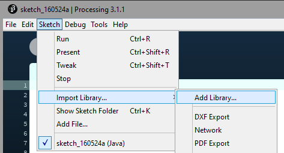
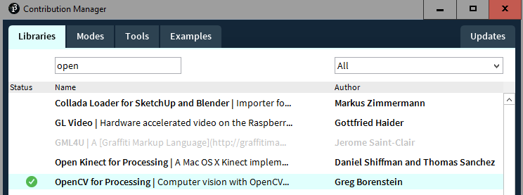
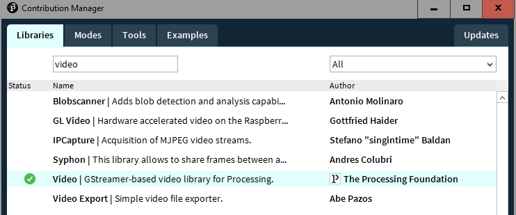
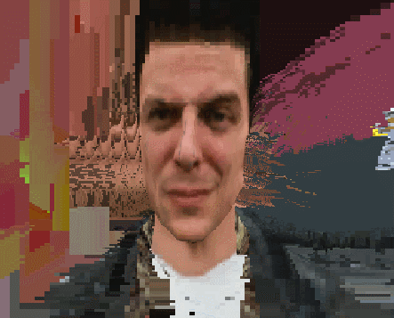
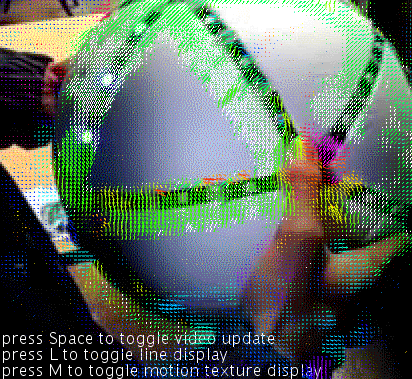
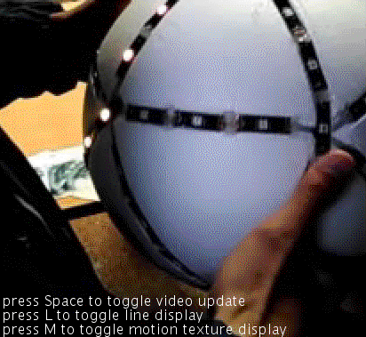

# What is happening in this gif ?

**OpenCV** is calculating **Optical Flow** from a video.  
Then **Processing** draws arrows showing the vector field.  
And a double **Frame Buffer** is applying texture coordinates displacement.

[](https://floptic.tumblr.com)

[You can find more gifs here](https://floptic.tumblr.com)

# Code Sources

If you are familiar with Processing you can check directly the [FrameBufferAndOpticalFlow.pde](FrameBufferAndOpticalFlow/FrameBufferAndOpticalFlow.pde).  
If not, I've made a little tutorial to explain all the layers behind the effect.  

# User Tool

I am working on a custom tool that can be used by non-coders.  
Meanwhile you have to know how to code to make the effect.  

# Tutorial

## Setup Processing

Download and install [Processing](https://processing.org/).  
Start a new sketch and open Contribution Manager.  



Add librairy "OpenCV" by Greg Borenstein (https://github.com/atduskgreg/opencv-processing/).  



Add librairy "Video" (https://processing.org/reference/libraries/video/index.html).  




## OpenCV Optical Flow example

You can check the full OpenCV for Processing code sources here :  
https://github.com/atduskgreg/opencv-processing

OpenCV for Processing reference :  
http://atduskgreg.github.io/opencv-processing/reference/

You can start looking at this example to get familiar with OpenCV :    
https://github.com/atduskgreg/opencv-processing/blob/master/examples/OpticalFlow/OpticalFlow.pde

```java
import gab.opencv.*;
import processing.video.*;

OpenCV opencv;
Movie video;

void setup() {
  size(1136, 320);
  video = new Movie(this, "sample1.mov");
  opencv = new OpenCV(this, 568, 320);
  video.loop();
  video.play();  
}

void draw() {
  background(0);
  opencv.loadImage(video);
  opencv.calculateOpticalFlow();

  image(video, 0, 0);
  translate(video.width,0);
  stroke(255,0,0);
  opencv.drawOpticalFlow();

  PVector aveFlow = opencv.getAverageFlow();
  int flowScale = 50;

  stroke(255);
  strokeWeight(2);
  line(video.width/2, video.height/2, video.width/2 + aveFlow.x*flowScale, video.height/2 + aveFlow.y*flowScale);
}

void movieEvent(Movie m) {
  m.read();
}
```

## Frame Buffer with Processing

What I call frame buffer is a render texture. All draw calls are drawn to a texture.  
The idea is to apply a persistent effect with shaders, and it implies that we have to read and write on the same texture. And that is not possible because of how hardware process memory.  
The solution is to have a double frame buffer, one for reading and another one for writing.  

An example of a custom displacement :  



This code shows how to setup and use a double frame buffer with Processing :  

```java
// frame buffer
PGraphics[] renderArray;
int currentRender;

// get the current frame buffer
PGraphics getCurrentRender () {
  return renderArray[currentRender];
}

// swap between writing frame and reading frame
void nextRender () {
  currentRender = (currentRender + 1) % renderArray.length;
}

void setup ()
{
  size(300, 300, P3D);

  // create a double frame buffer
  renderArray = new PGraphics[2];
  currentRender = 0;
  for (int i = 0; i < renderArray.length; ++i)
  {
    // PGraphics is like a render texture
    renderArray[i] = createGraphics(width, height, P3D);
    renderArray[i].beginDraw();
    renderArray[i].background(0);
    renderArray[i].endDraw();
  }
}

void draw ()
{
  // the frame buffer magic happen here
  PGraphics bufferWrite = getCurrentRender();
  nextRender();
  PGraphics bufferRead = getCurrentRender();

  // start recording render texture
  bufferWrite.beginDraw();

  // draw something using the PGraphics
  bufferWrite.shader([...])
  bufferWrite.image([...])

  // end of recording render texture
  bufferWrite.endDraw();

  // draw final image
  image(bufferWrite);
}
```

## GLSL Shader

To apply displacement on frame buffer, we can use shaders.  
It is great because we are using GPU to calculate all the displacement.  


This is pixel shader, also called fragment shader.  
It will return the color for a given pixel coordinate.  

```java
// textures send from Processing main script
uniform sampler2D motion;
uniform sampler2D frame;

// interpolated values from vertex shader
varying vec4 vertColor;
varying vec4 vertTexCoord;

void main()
{
	// get motion and video colors
	vec4 motionColor = texture2D(motion, vertTexCoord.st);

	// fix uv inversion
	vec2 uv = vertTexCoord.st;
	uv.y = 1.0 - uv.y;

	// extract angle from color
	float angle = atan(motionColor.g * 2.0 - 1.0, motionColor.r * 2.0 - 1.0);

	// create offset with angle and vector magnitude
	vec2 offset = vec2(cos(angle), sin(angle)) * motionColor.b * 0.01;

	// apply uv displacement
	vec4 framebufferColor = texture2D(frame, uv - offset);

	// assign color
  gl_FragColor = framebufferColor;
}
```

We get the angle and the length of the vector from the color.   
This information is encoded from CPU like this :  

```java
motionTexture.pixels[index] = color(direction.x * 0.5 + 0.5, direction.y * 0.5 + 0.5, min(1, motion.mag()));
```

Vector direction is normalized, we compress his range from [-1, 1] to [0, 1] so the color dont get negative value.  
So red is x, green is y and blue is the vector magnitude.  

Then we extract the angle from the red and green color :   

```java
atan(motionColor.g * 2.0 - 1.0, motionColor.r * 2.0 - 1.0);
```

## Voila

With this, you can make a lot of thing.  
You can start from the code sources provided and add your own layers of effects.  

This is what the example does :



Press Space to toggle frame buffer effect :



If you do anything cool with is, I would love to know.  
You can contact me on twitter here : [@leondenise](https://www.twitter.com/leondenise).  
And please share your code like everyone else in this open source community. <3  
